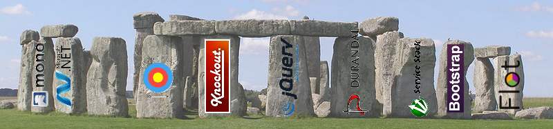

stonehenge
==========
An open source .NET Framework to use Web UI technologies for desktop and/or web applications.

Upcomming version V2.0 !
------------------------
What's new?
This version has an architecture and is no longer a proof of concept hack.

* Katana - the Microsoft Owin stack for self hosting replaces ServiceStack 3.x

* Aurelia (or AngularJS) replaces Durandal (Knockout, JQuery)

* Newtonsoft.JSON replaces ServiceStack JSON serializer

* Modularization and interfaces allow to replace this function modules using upcomming technologies

Still supported V1.x
--------------------
Due to more than one active project using the older stack
this will be continously supported.

New in version 1.30: Update to Knockout 3.3.0, simple struct support

New in version 1.20: Update to Durandal 2.1 and jQuery 2.1.3

New in version 1.10: Reuse sessions from cookies

New in version 1.00: Client side aborting event polling fixed sync problems of th UI
                     SSL support (also for CDN)
					 Fixed some Linux issues according to case sensivity of paths
					 Server side handling of client side binding exceptions added
					
Motivation
----------
Due to Microsofts unclear future of WPF and the lack of WPF support
with Mono on other platforms there was the idea to use HTML5/CSS for
use with desktop applications.

Compile one EXE - copy and run on multiple platforms: Windows, Ubuntu and even Raspberry Pi

There are always other products featuring this
* [awesomium](http://awesomium.com/)

But this is not free...

How It Works
------------
If your .NET WPF Application ist already using the MVVM pattern
just throw away the XAML views and replace them by HTML views.

The .NET framework part of doing XAML data binding is
replaced by a proxy and stub transferring data and knockout is used for client site binding.

Note: It's chatty - it's primary designed for local/intranet use.
Sample running on [http://stonehengecs.de/](http://stonehengecs.de/)

Current project state: Working (Basic)

A great application has to be founded on solid pilars of frameworks.

What It Is Not
--------------
There are no plans to support mobile platforms as native apps.
If you are looking for this - see [PhoneGap](http://phonegap.com/) for example.

The framework does not support offline scenarios.
You are free to implement more client side code on your own to achieve this.

Features
--------
* WPF like ViewModels
* No JavaScript coding necessary
* All controls usable using knockout bindings
* CDN support for js and css files
* Development environments: VS2010, VS2013, MonoDevelop, XamarinStudio
* VisualStudio template

Known bugs
----------
* none

TODO
----
* Documentation
* include toastr
* More controls
* Widgets
* localization support
* NUGET package

Planned Improvements
--------------------
* single responsible refactoring to isolate ServiceStack
* Replace ServiceStack due to V4.0 is no more open source
* refactoring to isolate client side technology
* Support AngularJS as client side technology
* Microsoft Azure hosted version
* Replace long running polls by modern communication as soon as commonly supported
#### Future Plans
* Use self hostet webkit

